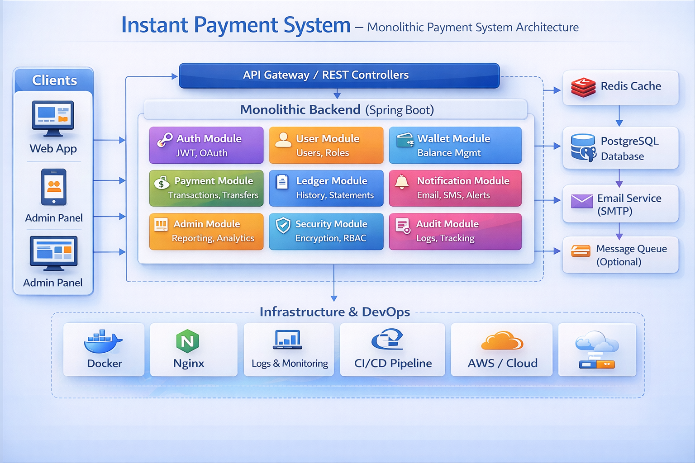

# 🌐 Instant Payment & Digital Wallet
Dynamic Payments • Secure Wallets • Real-Time Transactions • Built on Paymeny System


A modern, mobile-first financial application built with React, Vite, and Tailwind CSS that enables users to manage their digital wallet, send and receive money, track transactions, and analyze spending patterns with real-time currency conversion.

## Features

### 1. Dashboard (Home)
- Personalized greeting with time-based messages
- Real-time balance display with USD/INR toggle
- Quick action buttons (Send, Request, Add Money)
- Spending summary (Total Sent, Received, Net)
- Recent activity feed
- Currency switching with automatic conversion

### 2. Activity & Transaction Management
- Complete transaction history with advanced filtering
- Balance Summary widget
- Search functionality (by name, email, note, transaction ID)
- Advanced filters (status, category, date range)
- 6-month spending chart with sent/received breakdown
- Detailed transaction table
- Transaction type filtering (All, Sent, Received, Request, Refund)

### 3. Money Transfer
- Send money to other users via email
- Request money from users
- Support for payment notes
- Transaction status tracking
- Category tagging for transactions

### 4. Wallet Management
-  View current balance in USD/INR
-  Add and manage payment methods (Credit cards, Bank accounts)
-  Set default payment method
-  View payment method details
-  Delete payment methods

### 5. Analytics
- View spending patterns
- Transaction category breakdown
- Monthly comparison charts
- Filter by period and category

### 6. Profile & Settings
- User profile information
- Account settings
- System preferences
- Logout functionality

### 7. Notifications
- Transaction alerts
- Security notifications
- Money request updates
- Real-time notification system

## Tech Stack

### Frontend
- **React 18.2.0** - UI framework
- **Vite** - Build tool
- **TypeScript** - Type safety
- **Tailwind CSS** - Styling
- **shadcn/ui** - Component library

### State Management & Data Fetching
- **TanStack React Query 5.84.1** - Data fetching and caching
- **React Hook Form 7.54.2** - Form management
- **Zod 3.24.2** - Schema validation

### Routing
- **React Router DOM 6.26.0** - Client-side routing

### UI & Visualization
- **Lucide React 0.475.0** - Icons
- **Framer Motion 11.16.4** - Animations
- **Recharts 2.15.4** - Data visualization charts

### Utilities
- **date-fns 3.6.0** - Date formatting
- **Lodash 4.17.21** - Utility functions
- **React Markdown 9.0.1** - Markdown rendering
- **Sonner 2.0.1** - Toast notifications

### Backend Integration
- **Base44 SDK 0.8.28** - Backend as a Service

## Project Structure

```
src/
├── components/
│   ├── layout/
│   │   ├── Layout.tsx
│   │   ├── Header.tsx
│   │   └── Navigation.tsx
│   ├── dashboard/
│   │   ├── BalanceCard.tsx
│   │   ├── QuickActions.tsx
│   │   ├── SpendingSummary.tsx
│   │   └── RecentActivity.tsx
│   ├── ui/
│   │   ├── Button.tsx
│   │   ├── Card.tsx
│   │   ├── Dialog.tsx
│   │   ├── Input.tsx
│   │   ├── Badge.tsx
│   │   ├── Label.tsx
│   │   ├── Tabs.tsx
│   │   └── Table.tsx
│   ├── common/
│   ├── activity/
│   ├── wallet/
│   └── transaction/
├── pages/
│   ├── Dashboard.tsx
│   ├── Activity.tsx
│   ├── Analytics.tsx
│   ├── Wallets.tsx
│   ├── SendMoney.tsx
│   ├── RequestMoney.tsx
│   └── Profile.tsx
├── hooks/
│   └── useData.ts
├── services/
│   └── base44.ts
├── types/
│   └── index.ts
├── utils/
│   └── helpers.ts
├── constants/
│   └── index.ts
├── context/
├── App.tsx
├── main.tsx
└── index.css
```

## Installation

### Prerequisites
- Node.js 16+ 
- npm or yarn

### Setup Steps

1. **Install dependencies**
```bash
npm install
```

2. **Create environment file**
```bash
cp .env.example .env
```

3. **Configure environment variables**
Edit `.env` with your Base44 credentials:
```
VITE_BASE44_API_KEY=your_api_key
VITE_BASE44_PROJECT_ID=your_project_id
VITE_CURRENCY_RATE=83.5
```

4. **Start development server**
```bash
npm run dev
```

The application will open at `http://localhost:5173`

## Available Scripts

- `npm run dev` - Start development server
- `npm run build` - Build for production
- `npm run preview` - Preview production build locally
- `npm run lint` - Run ESLint

## Data Model

### Transaction
- Type: sent, received, request, refund
- Amount, Currency (USD/INR)
- Status: completed, pending, failed, cancelled
- Sender/Recipient info
- Category, Note, Payment Method

### Wallet
- User email, Balance (USD/INR)
- Current currency preference

### MoneyRequest
- Requester/Payer details
- Amount, Currency, Status
- Due date

### PaymentMethod
- Type: card or bank
- Card details: last 4 digits, expiry
- Bank details: name, account last 4 digits
- Default flag

### Notification
- Type: transaction, security, request
- Title, Message, Read status
- Related transaction/request ID

### User
- Email, Full name, Role
- Custom attributes

## Key Features Implementation

### Currency Conversion
- USD ↔ INR conversion rate: 83.5
- Automatic conversion on toggle
- Display in preferred currency

### Real-time Data Sync
- React Query for efficient caching
- Automatic refetching on mutations
- Optimistic updates

### Advanced Filtering
- Transaction type filter (All, Sent, Received, Request, Refund)
- Status-based filtering
- Date range filtering
- Category filtering

### Responsive Design
- Mobile-first approach
- Tailwind CSS responsive utilities
- Bottom navigation for mobile
- Horizontal scroll for tables

### Animations
- Framer Motion for smooth transitions
- Fade and slide animations
- Microinteractions for better UX

## API Integration

The application uses Base44 SDK for backend integration. Replace the mock implementations in `src/services/base44.ts` with actual Base44 API calls.

### Mock Service Currently Provides:
- Authentication endpoints
- Wallet operations
- Transaction management
- Money request handling
- Payment method management
- Notification system
- User profile management

## Future Enhancements

- [ ] Real Base44 SDK integration
- [ ] Push notifications
- [ ] Offline mode
- [ ] Payment gateway integration
- [ ] QR code payments
- [ ] Bill splitting
- [ ] Recurring transfers
- [ ] Investment features
- [ ] Enhanced security (biometric auth)
- [ ] Export transaction reports
- [ ] Advanced analytics

## Testing

Currently no test suite configured. Add testing framework (Jest/Vitest) and write tests for:
- Component rendering
- Form validation
- API calls
- Utility functions

## Deployment

### Build for Production
```bash
npm run build
```

### Deploy to Vercel, Netlify, or similar platforms
```bash
# The dist folder contains the optimized production build
```

## Browser Support
- Chrome (latest)
- Firefox (latest)
- Safari (latest)
- Edge (latest)

## Security Considerations

- Implement proper authentication
- Use HTTPS for all API calls
- Store sensitive data securely
- Implement rate limiting
- Add CSRF protection
- Sanitize user inputs
- Regular security audits

## License

MIT License

## Support

For issues and questions, please contact support or create an issue in the repository.
=======
# 🌐 Digital Wallet
Dynamic Payments • Secure Wallets • Real-Time Transactions • Built on Paymeny System


A **high-performance fintech payment infrastructure** designed to enable **secure, real-time money transfers** between users.  
The system focuses on **scalability, reliability, and financial data integrity**, following modern backend engineering and distributed system design practices.


## 📖 Overview

The Instant Payment System is a backend-focused financial platform that simulates the architecture of modern digital payment systems used by fintech companies. It allows users to securely transfer funds, manage digital wallets, track transaction history, and receive real-time notifications.

The platform is built with a modular backend architecture where each core capability—authentication, wallet management, payments, transaction ledger, and notifications—is organized into independent modules. This design improves maintainability, scalability, and separation of concerns.

To ensure performance and reliability, the system integrates database persistence, caching, secure authentication mechanisms, and infrastructure tooling commonly used in production fintech environments.

The system demonstrates how real-world payment platforms handle financial transactions, data consistency, security, and operational monitoring.

# 🎯 Key Objectives

- ⚡ Enable **real-time digital money transfers**
- 🔐 Maintain **secure financial transactions**
- 📊 Track **complete transaction history**
- 💰 Support **wallet balance management**
- 🔔 Deliver **real-time transaction notifications**
- 📈 Provide **administrative analytics and reporting**

## 🏗️ System Architecture

  The digital payment platform follows a monolithic backend architecture where all core modules operate within a single deployable service. This design simplifies           development and ensures strong transactional consistency for financial operations.

  The backend handles authentication, wallet management, payment processing, ledger recording, and notification services while maintaining data integrity and        security.

<h2 align="center">Instant Payment System Architecture</h2>

<p align="center">
  
</p>


# 🧰 Technology Stack

### ⚙ Backend
- Spring Boot
- REST APIs
- JWT Authentication

### 🗄 Database
- PostgreSQL

### ⚡ Caching
- Redis

### 🧱 Infrastructure
- Docker
- Nginx
- CI/CD Pipeline
- AWS Cloud

### 📡 Messaging (Optional)
- Message Queue for asynchronous processing

# 🚀 Project Goals

This project demonstrates how modern fintech systems are built with focus on:

- 🔐 Secure financial transactions  
- 📈 Scalable backend architecture  
- 🧩 Modular service design  
- 📊 Monitoring and observability  
- ☁ Cloud-ready infrastructure  

The architecture reflects patterns used in **modern payment platforms like Stripe, PayPal, and digital banking systems**.


# ✨ Core Features

### 👤 User Management
- User registration and authentication
- JWT based secure login
- Role-based access control (RBAC)

### 💰 Wallet Management
- Digital wallet creation
- Balance tracking
- Secure wallet operations

### 💳 Payment Processing
- Instant fund transfer
- Transaction validation
- Payment processing system

### 📜 Transaction Ledger
- Immutable transaction history
- Financial record keeping
- Transaction statements

### 🔔 Notification System
- Email notifications
- Transaction alerts
- System alerts

### 🛠 Admin Panel
- System analytics
- User monitoring
- Financial reporting


## 📁 Project Structure
    Instant-Payment-System
    │
    ├── docs
    │   └── architecture.png
    │
    ├── src
    │   ├── controller
    │   ├── service
    │   ├── repository
    │   ├── model
    │   └── security
    │
    ├── config
    │
    └── README.md


## Key Features
- Secure authentication and authorization
- Digital wallet management
- Peer-to-peer payments
- Transaction ledger tracking
- Real-time notifications
- Admin reporting and analytics
- Scalable monolithic backend architecture

## 🚀 Future Improvements
- Migration to microservices architecture
- Event-driven transaction processing
- Advanced fraud detection
- Distributed transaction management
- Observability using Prometheus and Grafana

## 👩‍💻 Project Maintainer

**Sumanjali Nuthanakanti**  
 - Full Stack & Systems Developer
 - https://github.com/Sumanjali-93
  
**Architecting scalable systems and building production-grade applications.**

## 📄 License

This project is licensed under the MIT License - 2026 Instant Payment System
>>>>>>> c33549298e702712c68e75a5c132e5b388655d7a
